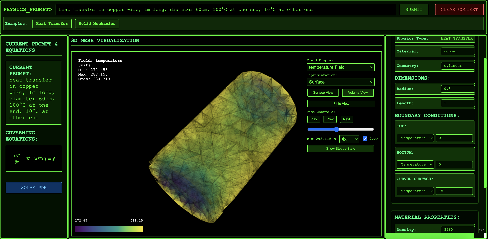

# Agentic FEM Simulation Framework

A modular, multi-agent finite element method (FEM) simulation system that processes natural language prompts to generate meshes, solve PDEs, and visualize results. Built with a multi-agent architecture and Model Context Protocol (MCP) integration.

## Preview



*The web interface provides an intuitive way to interact with the simulation system through natural language prompts.*

## Table of Contents

- [Preview](#preview)
- [Overview](#overview)
- [Architecture](#architecture)
- [Key Components](#key-components)
- [Workflow](#workflow)
- [Installation](#installation)
- [Usage](#usage)
- [API Endpoints](#api-endpoints)
- [Project Structure](#project-structure)
- [Configuration](#configuration)
- [Development](#development)

## Overview

This system provides an intelligent interface for finite element simulations by:

- **Natural Language Processing**: Parses user prompts to extract simulation parameters
- **Multi-Agent Orchestration**: Uses specialized agents for different aspects of simulation
- **Mesh Generation**: Creates meshes using GMSH for various geometries
- **PDE Solving**: Solves partial differential equations using FEniCS
- **Visualization**: Generates interactive 3D visualizations of meshes and field solutions
- **MCP Integration**: Exposes capabilities via Model Context Protocol for AI integration

### Supported Physics Types

- **Heat Transfer**: Steady-state and transient thermal analysis
- **Solid Mechanics**: Stress, strain, and displacement analysis

### Supported Geometries

- **1D**: Line, Rod, Bar
- **2D**: Plate, Rectangle, Square, Disc, Membrane
- **3D**: Cube, Box, Beam, Cylinder, Sphere

## Architecture

### Multi-Agent System

The system uses a **Master-Agent pattern** with specialized agents:

```
MasterAgent (Orchestrator)
├── PhysicsAgent (Physics type identification)
├── GeometryAgent (Geometry detection and validation)
├── MaterialAgent (Material property management)
├── BoundaryConditionAgent (Boundary condition parsing)
├── DimensionAgent (Dimension extraction)
├── MeshAgent (Mesh generation coordination)
└── SolverAgent (PDE solving coordination)
```

### Communication Mechanism

**AgentBus (Event Bus Pattern)**:
- **Publish-Subscribe Model**: Agents communicate via message bus
- **Message Types**: Task requests, task results, state updates, coordination
- **Decoupled Communication**: Agents don't know about each other directly
- **Event-Driven**: Agents react to messages and state changes

### MCP Architecture

**Model Context Protocol (MCP)** integration provides:
- **MCP Tools**: Actions that can be executed (generate_mesh, solve_pde, create_visualization)
- **MCP Resources**: Data that can be accessed (simulation context, mesh data, solution data)
- **Standardized Interface**: Enables AI model integration and external system interoperability

## Key Components

### 1. Master Agent (`agents/master_agent.py`)

Orchestrates specialized agents and manages the complete simulation workflow. Handles:
- Task delegation to specialized agents
- Workflow state management
- Context building and validation
- Error handling and recovery

### 2. Specialized Agents (`agents/specialized_agents/`)

- **PhysicsAgent**: Identifies physics type (heat_transfer, solid_mechanics)
- **GeometryAgent**: Detects and validates geometry types
- **MaterialAgent**: Manages material properties and validation
- **BoundaryConditionAgent**: Parses and validates boundary conditions
- **DimensionAgent**: Extracts geometry dimensions from prompts
- **MeshAgent**: Coordinates mesh generation using GMSH
- **SolverAgent**: Coordinates PDE solving and visualization

### 3. Simulation Manager (`apps/simulation/simulation_manager.py`)

Manages the complete simulation workflow:
- Parses simulation prompts
- Generates meshes
- Solves PDEs
- Creates visualizations
- Manages simulation state

### 4. NLP Parser (`nlp_parser/src/`)

Context-based parser that extracts simulation parameters from natural language:
- **PromptAnalyzer**: Main parser orchestrator
- **ContextBasedParser**: Context-aware parsing
- **TemplateManager**: Manages physics templates
- **GeometryClassifier**: Classifies geometry types

### 5. FEniCS Backend (`fenics_backend/`)

PDE solving capabilities:
- **FEniCSSolver**: Main solver interface
- **SolverCore**: Core solving logic
- **HeatTransferSolver**: Heat transfer specific solver
- **SolidMechanicsSolver**: Solid mechanics specific solver
- **BoundaryConditions**: Boundary condition handling
- **MeshManagement**: Mesh loading and processing

### 6. Frontend (`frontend/`)

Web interface components:
- **FrontendManager**: Main frontend coordinator
- **MeshVisualizer**: 3D mesh visualization
- **FieldVisualizer**: Field solution visualization
- **ConfigPanels**: Configuration UI components
- **TerminalInterface**: Terminal-style interface

### 7. MCP Server (`mcp/`)

Model Context Protocol server:
- **MCPServer**: Main MCP server implementation
- **Tools**: MCP tool definitions (mesh, solver, visualization, config)
- **Resources**: MCP resource definitions (simulation context, mesh data, solution data)

### 8. Configuration Manager (`config/config_manager.py`)

Centralized configuration management:
- Physics types and templates
- Material properties
- Boundary condition templates
- Geometry specifications
- Dimension requirements

## Workflow

### Complete Simulation Workflow

```
┌─────────────────────────────────────────────────────────────┐
│                    User Prompt                              │
│                  (Natural Language)                         │
└────────────────────────┬────────────────────────────────────┘
                         │
                         ▼
┌─────────────────────────────────────────────────────────────┐
│              Parsing Workflow (Master Agent)                │
│  ┌──────────┐  ┌──────────┐  ┌──────────┐                   │
│  │ Physics  │  │ Geometry │  │ Material │  (Parallel)       │
│  │  Agent   │  │  Agent   │  │  Agent   │                   │
│  └──────────┘  └──────────┘  └──────────┘                   │
│         │            │            │                         │
│         └────────────┴────────────┘                         │
│                      │                                      │
│                      ▼                                      │
│         ┌──────────┐  ┌──────────┐                          │
│         │Dimension │  │Boundary  │  (Sequential)            │
│         │  Agent   │  │  Agent   │                          │
│         └──────────┘  └──────────┘                          │
└────────────────────────┬────────────────────────────────────┘
                         │
                         ▼
┌─────────────────────────────────────────────────────────────┐
│            Simulation Context                               │
│  - Physics Type                                             │
│  - Geometry Type & Dimensions                               │
│  - Material Properties                                      │
│  - Boundary Conditions                                      │
└────────────────────────┬────────────────────────────────────┘
                         │
                         ▼
┌─────────────────────────────────────────────────────────────┐
│              Mesh Generation (Mesh Agent)                   │
│                  GMSH Mesh Generator                        │
└────────────────────────┬────────────────────────────────────┘
                         │
                         ▼
┌─────────────────────────────────────────────────────────────┐
│              PDE Solving (Solver Agent)                     │
│                 FEniCS Solver                               │
└────────────────────────┬────────────────────────────────────┘
                         │
                         ▼
┌─────────────────────────────────────────────────────────────┐
│              Visualization (Field Visualizer)               │
│              Interactive 3D Visualizations                  │
└─────────────────────────────────────────────────────────────┘
```

### Parsing Workflow Stages

1. **Stage A: Primary Identification (Parallel)**
   - PhysicsAgent, GeometryAgent, MaterialAgent run in parallel
   - Extract physics type, geometry type, and material type

2. **Stage B: Build Expectations**
   - Determine required dimensions from template
   - Get available boundaries from geometry

3. **Stage C: Clean Prompt**
   - Remove already-identified sections from prompt

4. **Stage D: Extract Dimensions and Boundary Conditions**
   - DimensionAgent extracts dimensions
   - BoundaryConditionAgent extracts boundary conditions

5. **Stage E: Determine Completeness**
   - Check if simulation context is complete
   - Return appropriate action (simulation_ready or request_info)

## Installation

### Prerequisites

- Python 3.8+
- GMSH (for mesh generation)
- FEniCS (for PDE solving)
- Node.js (for frontend dependencies)

### Setup

1. **Clone the repository**:
```bash
git clone <repository-url>
cd "Tech Challenge"
```

2. **Install Python dependencies**:
```bash
pip install -r requirements.txt
pip install -r requirements-fenics.txt
```

3. **Install FEniCS**:
```bash
# Follow FEniCS installation guide for your platform
# https://fenicsproject.org/download/
```

4. **Install GMSH**:
```bash
# macOS
brew install gmsh

# Linux
sudo apt-get install gmsh

# Or download from: https://gmsh.info/
```

5. **Install Node.js dependencies** (if needed):
```bash
npm install
```

6. **Set up environment variables**:
```bash
cp config.env.example config.env
# Edit config.env with your settings
# Required: OPENAI_API_KEY for NLP parsing
```

7. **Run the application**:
```bash
python -m apps.main_app
# Or use the start script
./start.sh
```

The application will be available at `http://localhost:8080`

## Usage

### Web Interface

1. Open `http://localhost:8080` in your browser
2. Enter a natural language prompt describing your simulation
3. The system will parse the prompt and extract simulation parameters
4. Review and adjust the configuration if needed
5. Generate mesh and solve the PDE
6. View interactive visualizations

### Example Prompts

**Heat Transfer**:
```
"Find the temperature distribution in a 1m long rod with 100°C at the left end and 20°C at the right end. The rod is made of steel."
```

**Solid Mechanics**:
```
"Calculate the stress in a 2m x 1m plate fixed at the left edge with 1000N force applied at the right edge. Material is aluminum."
```

### API Usage

#### Parse Simulation Prompt

```bash
curl -X POST http://localhost:8080/simulation/parse \
  -H "Content-Type: application/json" \
  -d '{
    "prompt": "heat transfer in a 1m rod with 100°C at left and 20°C at right",
    "context": {}
  }'
```

#### Generate Mesh Preview

```bash
curl -X POST http://localhost:8080/mesh/preview \
  -H "Content-Type: application/json" \
  -d '{
    "geometry_type": "rod",
    "dimensions": {"length": 1.0}
  }'
```

#### Run Complete Simulation

```bash
curl -X POST http://localhost:8080/simulation/solve \
  -H "Content-Type: application/json" \
  -d '{
    "prompt": "heat transfer in a 1m rod with 100°C at left and 20°C at right",
    "context": {}
  }'
```

## API Endpoints

### Simulation Endpoints

- `POST /simulation/parse` - Parse simulation prompt
- `POST /simulation/solve` - Run complete simulation workflow
- `POST /parse_boundary_condition` - Parse boundary condition change
- `POST /update_boundary_condition` - Update boundary condition

### Mesh Endpoints

- `POST /mesh/preview` - Generate mesh preview
- `GET /mesh/supported-geometries` - Get supported geometry types

### Configuration Endpoints

- `GET /config` - Get current configuration
- `POST /config/update` - Update configuration value
- `POST /config/reset` - Reset configuration to defaults
- `GET /config/geometry` - Get geometry configuration
- `GET /config/simulation` - Get full simulation configuration
- `GET /config/boundary-condition-templates` - Get boundary condition templates
- `GET /config/physics-types` - Get available physics types
- `GET /config/dimensions-spec` - Get dimensions specification

### MCP Endpoints

- `POST /mcp` - Handle MCP protocol requests
- `GET /mcp/tools` - List all available MCP tools
- `GET /mcp/resources` - List all available MCP resources
- `POST /mcp/tools/call` - Call an MCP tool
- `GET /mcp/resources/{uri}` - Get an MCP resource

### Agent System Endpoints

- `GET /agents/status` - Get status of all agents
- `POST /agents/reset` - Reset all agents

### Frontend Endpoints

- `GET /frontend/status` - Get frontend system status
- `POST /frontend/visualization/mesh` - Create mesh visualization
- `POST /frontend/visualization/field` - Create field visualization
- `POST /frontend/report` - Create results report
- `POST /frontend/cleanup` - Clean up old frontend files

### Utility Endpoints

- `GET /` - Main web interface
- `GET /health` - Health check endpoint
- `GET /docs` - API documentation (Swagger)
- `POST /clear-context` - Clear all simulation context

## Project Structure

```
Tech Challenge/
├── agents/                    # Multi-agent system
│   ├── master_agent.py       # Master orchestrator
│   ├── base_agent.py         # Base agent class
│   ├── communication/        # Agent communication
│   │   └── agent_bus.py      # Event bus for agents
│   └── specialized_agents/   # Specialized agents
│       ├── physics_agent.py
│       ├── geometry_agent.py
│       ├── material_agent.py
│       ├── boundary_condition_agent.py
│       ├── dimension_agent.py
│       ├── mesh_agent.py
│       └── solver_agent.py
├── apps/                      # Application modules
│   ├── main_app.py           # FastAPI main application
│   ├── mesh_viewer/          # Mesh viewing and generation
│   └── simulation/           # Simulation management
│       └── simulation_manager.py
├── config/                    # Configuration files
│   ├── config_manager.py     # Central config manager
│   ├── config.json           # Main configuration
│   ├── dimensions.json       # Geometry dimensions
│   ├── geometry_boundaries.json  # Boundary definitions
│   ├── material_properties.json  # Material properties
│   └── boundary_conditions.json  # BC templates
├── fenics_backend/           # FEniCS solver backend
│   ├── solver_core.py        # Core solver logic
│   ├── local_fenics_solver.py  # FEniCS solver interface
│   ├── local_field_visualizer.py  # Field visualization
│   ├── solvers/              # Physics-specific solvers
│   │   ├── heat_transfer.py
│   │   └── solid_mechanics.py
│   └── ...
├── frontend/                 # Web frontend
│   ├── frontend_manager.py   # Frontend coordinator
│   ├── components/          # UI components
│   ├── visualizers/         # Visualization components
│   ├── static/             # Static assets
│   └── templates/           # HTML templates
├── mcp/                     # Model Context Protocol
│   ├── mcp_server.py        # MCP server implementation
│   ├── tools/               # MCP tool definitions
│   └── resources/           # MCP resource definitions
├── mesh/                    # Mesh generation
│   ├── mesh_generator.py   # Main mesh generator
│   └── utils/               # Mesh utilities
├── nlp_parser/              # NLP parsing
│   └── src/                 # Parser source code
│       ├── prompt_analyzer.py
│       ├── context_based_parser.py
│       ├── template_manager.py
│       └── ...
├── requirements.txt         # Python dependencies
├── requirements-fenics.txt  # FEniCS dependencies
└── README.md                # This file
```

## Configuration

### Environment Variables

Create a `config.env` file with:

```env
OPENAI_API_KEY=your_openai_api_key
OPENAI_MODEL=gpt-4
LOG_LEVEL=INFO
```

### Configuration Files

- `config/config.json` - Main application configuration
- `config/dimensions.json` - Geometry dimension specifications
- `config/geometry_boundaries.json` - Available boundaries per geometry
- `config/material_properties.json` - Material property definitions
- `config/boundary_conditions.json` - Boundary condition templates

### Physics Templates

Physics-specific templates are in `nlp_parser/templates/`:
- `heat_transfer_template.json`
- `solid_mechanics_template.json`

## Development

### Running in Development Mode

```bash
# With auto-reload
uvicorn apps.main_app:app --reload --host 0.0.0.0 --port 8080
```

### Testing

```bash
# Run tests (if available)
pytest tests/
```

### Logging

Logging is configured in `config/logging_config.py`. Set `LOG_LEVEL` in environment to control verbosity.

### Adding New Agents

1. Create a new agent class extending `BaseAgent`
2. Implement required methods
3. Register in `MasterAgent.__init__()`
4. Add agent-specific tasks in `MasterAgent.execute_task()`

### Adding New Physics Types

1. Create a new template in `nlp_parser/templates/`
2. Add physics-specific solver in `fenics_backend/solvers/`
3. Update `config/config.json` with physics type
4. Update boundary condition templates if needed

## Architecture Benefits

### Multi-Agent System Benefits

- **Modularity**: Each agent has a single, well-defined responsibility
- **Parallel Processing**: Independent agents can work simultaneously
- **Scalability**: New agents can be added without modifying existing code
- **Fault Tolerance**: Agent failures are isolated
- **Testability**: Agents can be tested independently

### MCP Architecture Benefits

- **Standardized Interface**: All tools and resources use MCP protocol
- **AI Integration**: AI models can use MCP tools directly
- **External Integration**: External systems can integrate via MCP
- **Tool Discovery**: Tools and resources are discoverable
- **Protocol Compliance**: MCP ensures protocol compliance

## License

See `LICENSE` file for details.

## Contributing

1. Fork the repository
2. Create a feature branch
3. Make your changes
4. Submit a pull request

## Support

For issues and questions, please open an issue on the repository.

---

**Version**: 2.2.0  
**Architecture**: Modular Design + Master-Agent System + MCP Integration  
**Status**: Active Development

